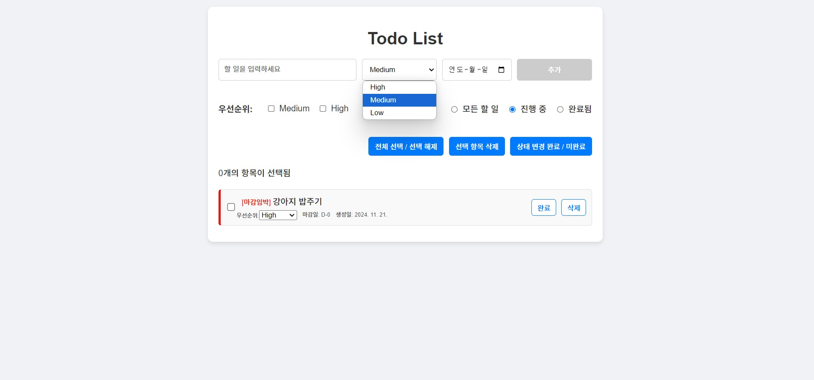
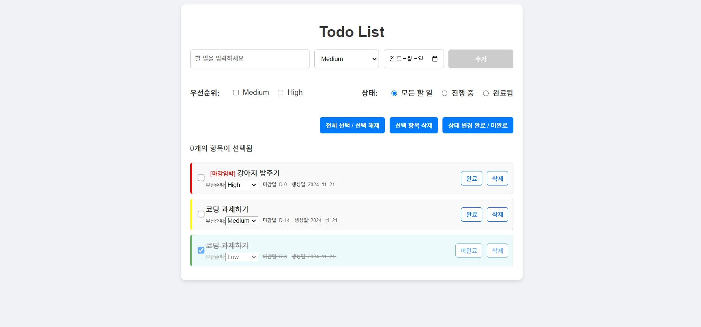

# ToDoMate

## 프로젝트 개요
**ToDoMate**는 React를 사용한 직관적인 할 일 관리 애플리케이션입니다. 사용자는 마감일, 우선순위, 상태 필터 등을 활용해 할 일을 효율적으로 관리할 수 있습니다.

### 주요 기능
- **할 일 추가**: 할 일, 우선순위, 마감일을 입력하여 관리 가능.
- **상태 관리**: 할 일 완료/미완료 상태 전환, 선택 및 삭제 기능.
- **필터링**: 우선순위, 상태별로 할 일 목록 필터링.
- **마감일 알림**: 마감 임박 항목에 대한 경고 표시.
- **로컬 스토리지 저장**: 데이터를 브라우저에 저장하여 새로고침 후에도 유지.

---

## 설치 및 실행

### 1. 클론하기
GitHub에서 프로젝트를 클론합니다:
```bash
git clone https://github.com/username/ToDoMate.git
```

### 2. 의존성 설치
클론한 디렉토리로 이동하여 필요한 의존성을 설치합니다:
```bash
cd ToDoMate
npm install
```

### 3. 실행
개발 서버를 실행합니다:
```bash
npm start
```
브라우저에서 [http://localhost:3000](http://localhost:3000)으로 접속합니다.

---

## 폴더 구조

```
ToDoMate/
├── components/         # 주요 컴포넌트 폴더
│   ├── TodoFilter.js   # 필터링 컴포넌트
│   ├── TodoInput.js    # 입력 컴포넌트
│   ├── TodoItem.js     # 개별 할 일 항목 컴포넌트
│   └── TodoList.js     # 할 일 목록 컴포넌트
├── App.js              # 메인 애플리케이션 컴포넌트
├── App.css             # 스타일 파일
├── index.js            # 진입점 파일
└── public/
```

---

## 주요 컴포넌트

### 1. `TodoInput`
사용자가 새로운 할 일을 추가할 수 있는 컴포넌트입니다.
- **우선순위**: High, Medium, Low
- **마감일 유효성 검사**: 마감일은 오늘 이후로만 설정 가능.

### 2. `TodoList`
정렬된 할 일 목록을 보여주는 컴포넌트입니다.
- **정렬 기준**: 완료 상태 > 우선순위 > 마감일.

### 3. `TodoItem`
각 할 일 항목을 관리하는 컴포넌트입니다.
- **마감일 계산**: `D-` 또는 `D+` 형식으로 표시.
- **우선순위 색상 표시**:
  - High: 빨강
  - Medium: 노랑
  - Low: 초록
- **상태 관리**: 완료/미완료 전환, 선택, 삭제.

### 4. `TodoFilter`
우선순위 및 상태별로 할 일 목록을 필터링할 수 있는 컴포넌트입니다.
- **우선순위**: High, Medium, Low 선택 가능.
- **상태**: 모든 항목, 진행 중, 완료됨.

---

## 이미지 미리보기

### 애플리케이션 스크린샷
<br>
할 일 등록     
<br>
우선순위 지정 및 세부 기능      

---

## 기술 스택
- **프론트엔드**: React, HTML, CSS
- **데이터 관리**: LocalStorage
- **스타일링**: CSS (모듈화)

---

## 기여 방법
1. 이 프로젝트를 포크합니다.
2. 새로운 브랜치를 생성합니다: `git checkout -b feature/new-feature`
3. 변경 사항을 커밋합니다: `git commit -m 'Add new feature'`
4. 브랜치에 푸시합니다: `git push origin feature/new-feature`
5. Pull Request를 생성합니다.

---
